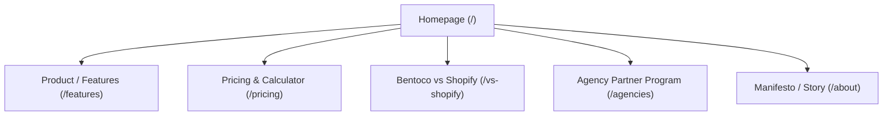

# BentoCo Website Strategy & Architecture (Phase 2)

---

## 1. Site Objectives & Primary Conversion Goals

### Primary Business Objectives:
1. **Position BentoCo as the Definite "Bharat Commerce Engine":** Plant the flag as the unassailable anti-Shopify choice built specifically for Indian e-commerce.
2. **Drive Merchant Self-Serve Signups:** Convert solo operators and D2C brand founders directly into trial/account signups.
3. **Acquire Agency Partners:** Drive digital marketing and e-commerce agencies to join the "Bharat Commerce Partner Program" (30% recurring revenue share).
4. **Demonstrate Total Cost & Margin Superiority:** Visually prove the massive savings over Shopify's "App Tax" and 2% transaction penalty.

### Primary Conversion Goals:
- **Primary CTA (Merchants):** "Start Free 14-Day Trial" / "Build Your Store in 60 Seconds" (Direct to `/signup` / Merchant Admin onboarding).
- **Secondary CTA (Agencies):** "Become a Partner" / "Apply for Agency Access" (Direct to `/agencies`).
- **Interactive Micro-Conversion:** "Calculate Your Shopify Savings" (Interactive ROI/App-Tax Calculator widget on the homepage).

---

## 2. Target Audiences & Persona Journeys

### Persona A: The Bootstrapping Solo D2C Founder ("Rahul")
- **Profile:** Running an apparel or lifestyle brand doing ₹2L–₹8L/mo on Instagram/Shopify. Single-handed operator.
- **Pain Points:** Paying ₹12,000/mo for Shopify apps (COD OTP, WhatsApp, Reviews, Fast Checkout); losing 30% revenue to fake COD orders (RTOs); website slow on mobile 4G.
- **Desired Outcome:** Low fixed monthly software cost, zero 2% gateway penalties, zero fake COD orders, lightning-fast store.
- **User Journey:**
  `Homepage Hero` ➔ `App Tax Calculator` ➔ `COD OTP & Prepaid Flip Interactive Demo` ➔ `Pricing Comparison` ➔ `Start Free Trial`.

### Persona B: The Performance Marketing Agency Owner ("Vikram")
- **Profile:** Runs a 10-person ad agency in Mumbai/Pune with 20 D2C clients.
- **Pain Points:** High client churn because Facebook ad ROAS drops when COD orders bounce (RTO); nightmare of managing 20 separate Shopify logins; Shopify's 20% affiliate program is weak.
- **Desired Outcome:** Protecting client ad performance by reducing RTOs, a single "God Mode" partner dashboard, 30% recurring SaaS commission + 10% WhatsApp wallet cut.
- **User Journey:**
  `Homepage Navigation ("For Agencies")` ➔ `/agencies Page` ➔ `Agency Revenue Calculator` ➔ `God Mode Dashboard Preview` ➔ `Apply for Partner Program`.

---

## 3. Information Architecture & Sitemap

### Global Header Navigation:
- **Logo:** BentoCo (Brutalist, monochrome logo)
- **Nav Links:** `Features` | `Why Us vs Shopify` | `Pricing` | `For Agencies` | `Manifesto`
- **Right CTA Cluster:** `Login` | `Start Free Trial` (Primary Button)

### Global Footer Navigation:
- **Product:** Core Engine, BYOG Payments, COD OTP Defense, WhatsApp Automation, Storefront Themes.
- **Comparisons:** vs Shopify, vs Dukaan, vs StoreHippo.
- **Partners:** Agency Partner Program, God Mode Dashboard.
- **Resources:** Documentation, API Status, Calculators, GST Guide.

---

## 4. Recommended Pages & Wireframe Structures

### Page 1: Homepage (`/`)

#### Section 1: Hero Section
- **Headline:** The E-Commerce Engine Built for the Way India Shops.
- **Sub-headline:** Stop paying an American platform in dollars to sell to buyers in India paying Cash-on-Delivery. Sub-second storefronts, native WhatsApp OTP, zero gateway fees, and zero App Tax out of the box.
- **CTAs:** `[Start Free 14-Day Trial]` (Primary) | `[See Interactive Demo]` (Secondary)
- **Social Proof Bar:** "Powering D2C brands processing over ₹50 Cr in GMV across India."

#### Section 2: The Core Market Gap (Interactive Savings Calculator)
- **Concept:** "The Shopify App Tax Extortion vs. BentoCo Engine"
- **Interactive Component:** Slider for Monthly GMV. Displays Shopify Base + 7 Apps + 2% Penalty cost (e.g. ₹14,500/mo) vs BentoCo Flat Rate (e.g. ₹1,999/mo).
- **Copy:** "You don't need 10 apps to run an Indian store. You just need an engine built for India."

#### Section 3: The 3 "Bharat Commerce" Pillars (Feature Grid)
1. **India Runs on WhatsApp, Not Email:** Native Evolution API integration. 4-digit COD OTP verification, automated order tracking, and 30-min WhatsApp cart recovery without Meta per-message fees.
2. **India Pays at the Door (or UPI):** BYOG (Bring Your Own Gateway) for Razorpay, Cashfree, and PhonePe with 0% platform transaction fees. 1-Click UPI Intent deep-links for GPay/PhonePe.
3. **India Browses on Volatile 4G:** High-performance storefronts delivering sub-1-second load speeds.

#### Section 4: The Native App Matrix (Replacing Shopify Apps)
- Visual comparison table showing 12 native features (WhatsApp Reviews, Smart Address Autocomplete, In-Cart Bumps, Sticky ATC, Self-Serve Returns Portal) replacing ₹12,000/mo worth of Shopify apps.

#### Section 5: The "Pre-Paid Flip" Interactive Showcase
- Interactive visual diagram demonstrating how high-risk COD orders are paused in `PENDING_OTP` state and automatically flipped into non-refundable UPI prepaid orders via automated WhatsApp discount triggers.

#### Section 6: Social Proof & Testimonials
- Quote cards from Indian D2C founders and performance marketing agencies highlighting RTO reduction from 32% to 11% and software savings.

#### Section 7: Pricing Teaser & Final CTA
- Comparison box + High-impact banner CTA: "Reclaim Your Margins Today."

---

### Page 2: BentoCo vs Shopify (`/vs-shopify`)

#### Section 1: Hero Banner
- **Headline:** Why Paying Shopify in Dollars for Indian Commerce is Bleeding Your Brand.
- **Sub-headline:** The honest architectural comparison between Western legacy platforms and the Bharat Commerce Engine.

#### Section 2: Detailed Head-to-Head Comparison Matrix

| Feature / Dimension | Shopify (Basic Plan) | BentoCo (Bharat Engine) | Why It Matters for India |
|---|---|---|---|
| **Base Subscription** | ~$25/mo (~₹2,100 post-GST) | ₹1,999/mo flat | Flat INR pricing without FX fluctuations |
| **Transaction Fee** | 2.0% penalty (No Shopify Payments in India) | **0% Platform Fee** (BYOG) | Keep your margins on every sale |
| **App Stack Cost** | ₹11,000–₹14,000/mo (7–10 apps) | **₹0** (All hardcoded natively) | Eliminates the App Tax |
| **COD Verification** | Requires 3rd-party app (GoKwik/Shopflo) | Native 4-Digit WhatsApp OTP | Stops RTO ghost orders at the door |
| **UPI Payment Flow** | Web redirects (high drop-off) | 1-Click Native UPI Intent | GPay/PhonePe open instantly on mobile |
| **WhatsApp Pipeline** | Third-party paid APIs (Meta per-msg fee) | Native Evolution API (QR Linked) | Zero per-message overhead fees |
| **Mobile Speed** | Bloated JS from 10 apps (3–5s load) | Sub-1s SSG Storefront | Converts users on 4G networks |

#### Section 3: Deep-Dive Problem Breakdowns
- **The 2% Penalty Explained:** Diagram showing how Shopify charges 2% on top of Razorpay's 2%, taking 4% total of merchant GMV.
- **The Performance Death Spiral:** How installing Loox + GoKwik + Tidio degrades PageSpeed scores from 85 to 22.

---

### Page 3: Agency Partner Program (`/agencies`)

#### Section 1: Hero Section
- **Headline:** Turn RTO Reduction into Your Agency's Most Profitable Retainer Shield.
- **Sub-headline:** Stop losing performance marketing clients because Shopify's broken COD system kills their ROAS. Move them to BentoCo, cut their RTOs by 30%, and earn **30% recurring commission for life**.

#### Section 2: The Agency Revenue Calculator
- Interactive slider: "Number of Active Clients Managed."
- Output: Monthly Passive Agency Revenue (30% SaaS recurring + 10% WhatsApp wallet cut).

#### Section 3: The "God Mode" Multi-Store Partner Dashboard
- Feature breakdown of the agency panel: Single login for 25 stores, 1-click store switching, client team RBAC, centralized billing, and 1-click store migration.

#### Section 4: The "Boots on the Ground" Partner Benefits
- **The Founder's Lock-in Deal:** Exclusive ₹2,999/mo lifetime rate agencies can offer clients.
- **White-Glove Migration Service:** BentoCo team handles 1-Click Shopify CSV migration for agency clients.

---

### Page 4: Pricing & ROI Calculator (`/pricing`)

#### Section 1: Pricing Header & Toggle
- Monthly vs Annual Toggle (Save 17% on Annual).

#### Section 2: The Three Tier Cards
1. **Launch Tier (₹1,999/mo):** For solo operators under ₹5L/mo GMV. Includes 1 Storefront, BYOG 0% fees, basic RTO shield, native logistics, 100 free WhatsApp automations.
2. **Scale Tier (₹4,499/mo - Recommended):** For growing brands ₹5L–₹25L/mo. Includes advanced Pre-Paid Flip, Pincode auto-fill, WhatsApp photo reviews, cart recovery, 1,000 free WhatsApp automations, full `DESIGN.md` customizer.
3. **Velocity Tier (₹9,999/mo):** For high-volume brands ₹25L+/mo. Unlimited staff, micro-affiliate generator, wholesale promos, priority support, 5,000 free WhatsApp automations.

#### Section 3: Detailed Side-by-Side Feature Matrix
- Granular breakdown of limits, staff accounts, storage, and WhatsApp rates.

#### Section 4: Comprehensive Pricing FAQ
- Addresses questions regarding gateway setup, WhatsApp API hosting, domain pointing, and data ownership.

---

## 5. Messaging Hierarchy & CTA Strategy

### Messaging Priority Hierarchy:
1. **Hook (Top of Funnel):** Financial impact (Stop paying the App Tax & 2% penalty; reduce RTO losses).
2. **Proof (Middle of Funnel):** Architecture & Localization (Sub-1s speed, native WhatsApp OTP, 1-click UPI Intent).
3. **Confidence (Bottom of Funnel):** Frictionless migration (1-Click Shopify CSV Importer, 14-day free trial, no credit card required).

### Call-to-Action (CTA) Framework:
- **Primary Header CTA:** `Start Free 14-Day Trial`
- **Hero CTA:** `Start Free Trial` | `Calculate Savings`
- **Mid-Page CTAs:** `Migrate Your Shopify Store in 60s`
- **Agency CTAs:** `Apply for Agency Partner Access`

---

## 6. SEO, Social Proof & Trust Strategy

### SEO Keyword Strategy:
- **Primary Keywords:** Shopify alternative India, Indian e-commerce platform, reduce COD RTO India, UPI intent checkout platform, zero transaction fee e-commerce India.
- **Secondary Keywords:** Dukaan alternative, StoreHippo alternative, native WhatsApp order tracking, Shiprocket integration e-commerce builder.

### Trust-Building & Social Proof Elements:
- **Real-Time Savings Badges:** "Average merchant saves ₹1,32,000/year."
- **Technical Badges:** Powered by PostgreSQL RLS, Evolution API, Cloudflare Security.
- **No-Risk Guarantee:** "100% Data Ownership. Export your products, orders, and customers anytime with 1 click."
