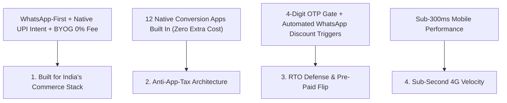

# BentoCo Messaging Framework & Positioning System (Phase 3)

---

## 1. Core Positioning & Brand Architecture

### Strategic Positioning Statement:
For Indian D2C brands and solo operators who are bleeding margins to Shopify's app tax, 2% transaction penalties, and COD return losses (RTO), **BentoCo** is the high-density e-commerce engine engineered from the ground up for how India shops. Unlike legacy Western platforms that treat UPI, WhatsApp, and COD as expensive third-party workarounds, BentoCo hardcodes native sub-second storefronts, WhatsApp OTP verification, prepaid UPI flips, and BYOG payment integrations directly into the platform core with zero transaction fees.

### Value Proposition:
**The Anti-Shopify E-Commerce Engine for Bharat.**
Eliminate ₹12,000/month in third-party app subscriptions, wipe out 2% transaction penalties, cut COD return losses by up to 40%, and deliver sub-1-second mobile shopping experiences on 4G networks.

### Brand Promise:
**Your Margins Back.** Every native feature built into BentoCo exists to protect merchant profits, eliminate unnecessary fees, and turn Indian e-commerce friction into automated conversion.

---

## 2. Elevator Pitches

### 10-Second Pitch (The Hook):
"Why pay an American company in dollars to sell a t-shirt to a customer in Pune paying Cash-on-Delivery? BentoCo is the e-commerce engine built specifically for India—with native WhatsApp OTPs, 1-click UPI, sub-second speed, and zero transaction fees."

### 30-Second Pitch (Merchant Focus):
"Shopify was built for credit cards and email in the US. In India, it forces you to spend ₹12,000 a month on 7 different apps just to verify COD orders, send WhatsApp tracking, and check pincodes—and then takes a 2% penalty on every sale. BentoCo hardcodes all these features natively into a sub-second mobile engine. You bring your own Razorpay or PhonePe gateway, pay zero transaction fees, cut your COD returns by 30%, and save over ₹1.2 Lakhs a year."

### 60-Second Pitch (Agency & Investor Focus):
"Indian D2C is a $108B market operating on an infrastructure mismatch. Merchants spend millions on Facebook ads, but 30% of their Cash-on-Delivery sales end up as returned shipping losses (RTO). Performance agencies keep losing clients because ad ROAS gets crushed by these returns. BentoCo solves this at the database level. Our native 'Pre-Paid Flip' engine pauses unverified orders, sends WhatsApp OTPs, and dynamically converts COD buyers into prepaid UPI customers. By giving agencies a single God Mode dashboard to manage client stores and offering 30% recurring SaaS commissions, BentoCo isn't just a website builder—it's the margin-protection infrastructure for Indian commerce."

---

## 3. Core Messaging Pillars



---

## 4. Headline & Tagline Library

### Taglines:
- *Built for the way India shops.*
- *The Anti-Shopify for Bharat.*
- *Get your margins back.*
- *Zero App Tax. Zero Transaction Penalties. 100% Indian Infrastructure.*
- *Sub-Second Speed. WhatsApp-First. RTO-Shielded.*

### Category-Specific Headlines:
- **On Margin Protection:** "Stop Bleeding Money to American Software and Indian Shipping Bounces."
- **On Speed & Technology:** "Sub-Second Storefronts Engineered for Volatile 4G Networks."
- **On Checkout & Payments:** "1-Click Native UPI Intent. Zero Platform Transaction Penalties."
- **On RTO & COD:** "Stop Ghost COD Orders Before They Lock Up Your Inventory."

---

## 5. Tone of Voice & Lexicon Guidelines

### Brand Voice Principles:
1. **Direct & Uncompromising:** We call out market flaws directly without corporate jargon.
2. **Empathetic to Merchant Margins:** We talk in terms of rupees saved, RTO percentages reduced, and ROAS protected.
3. **Technically Authoritative:** We highlight edge-rendering, PostgreSQL RLS, and WhatsApp protocol drivers to demonstrate engineering excellence.

### Vocabulary Matrix:

| Approved Vocabulary (Use Always) | Forbidden Vocabulary (Avoid Strictly) | Why |
|---|---|---|
| **Bharat Commerce Engine** | Generic Website Builder | Positions BentoCo as specialized infrastructure, not a simple builder. |
| **The App Tax** | Third-party plugin suite | Frames competitor app ecosystems as an aggressive financial penalty. |
| **Pre-Paid Flip** | Upfront discount trigger | Memorable productized name for COD-to-Prepaid conversion. |
| **BYOG (Bring Your Own Gateway)** | Custom payment integration | Emphasizes direct gateway credentials without platform transaction taxes. |
| **RTO Defense / Shield** | Address validation tool | Focuses on preventing shipping losses rather than basic input validation. |
| **Vibe Presets** | Free website templates | Sounds modern, curated, and design-forward. |

---

## 6. Objection Handling Framework

### Objection 1: "I'm already on Shopify and migrating sounds like a nightmare."
- **Positioning Response:** "You can port your entire store in under 60 seconds. Our 1-Click Shopify CSV Importer instantly transfers all your titles, prices, descriptions, variants, and images. Your customer data remains 100% yours, and you immediately save ₹12,000/month on app subscriptions."

### Objection 2: "Why wouldn't I just use Dukaan or Instamojo if I want a cheap Indian builder?"
- **Positioning Response:** "Dukaan and Instamojo are cheap catalog builders, but they lack conversion power, customization, and scalability. Their automation scores are low, and they don't give you custom storefronts or full design control. BentoCo combines Dukaan's low cost with enterprise-grade conversion tools, giving you enterprise performance without enterprise bloat."

### Objection 3: "Is WhatsApp automation expensive with Meta's official per-message fees?"
- **Positioning Response:** "No. BentoCo integrates natively with the open-source Evolution API via Linked Devices. You bypass Meta's per-message corporate fees completely by linking your standard WhatsApp Business account, paying only a tiny, predictable prepaid wallet fee."

---

## 7. Competitive Matrix & Tactical Positioning

```
[ Market Positioning Grid ]

              HIGH CONVERSION & AUTOMATION
                          │
                          │        ★ BentoCo (Bharat Engine)
                          │        (High Speed, High Conversion, Low Cost)
                          │
  StoreHippo / Fynd ──────┼────── Shopify + 10 Apps
  (Enterprise, Complex,   │       (High Cost, Heavy Bloat, 2% Tax)
   High Cost)             │
                          │
  ────────────────────────┼────────────────────────
                          │
                          │        Dukaan / Instamojo
                          │        (Cheap, Low Conversion, Basic UI)
                          │
              LOW CONVERSION & AUTOMATION
```
