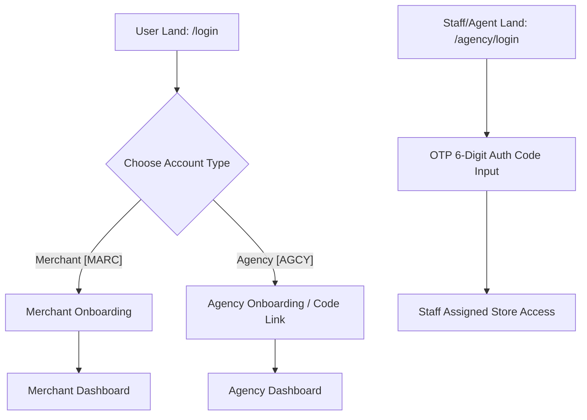

# Implementation Plan: Unified Auth & Separate Onboarding

This plan outlines the architecture and tasks required to decouple the authentication entry points and create separate onboarding steps for Merchants (MARC) and Agencies (AGCY).

---

## 1. Architectural Flow Chart

---

## 2. Key Deliverables & Database Schema Updates

### Database Schema Updates (`prisma/schema.prisma` or migration files)
* **User Profile Extensions:**
  * Add a `role` enum field to the User/Profile model (`MERCHANT` or `AGENCY`).
  * Add `onboarding_completed` boolean flags.
* **Temporary Authorization Ledger (`agency_temp_access`):**
  * Table to keep track of generated temporary 6-digit codes.
  * Columns: `id (UUID)`, `member_email (VARCHAR)`, `store_id (VARCHAR)`, `access_code (VARCHAR(6))`, `expires_at (TIMESTAMP)`, `is_used (BOOLEAN)`.

---

## 3. Step-by-Step Task List

### Phase 1: Authentication Interface Splitting
* [ ] **Update `/login`:** Make standard email/password or OAuth input register a base individual user.
* [ ] **Create Role Choice UI (`/register/role-selection`):** A beautiful onboarding step where users click custom graphic cards selecting **Merchant** or **Agency**.
* [ ] **Create `/agency/login`:** Create a dedicated, minimal, dark-themed page containing the split **3x3 OTP code input boxes** for staff members logging in with temporary codes.

### Phase 2: Onboarding Flow Customization
* [ ] **Merchant Onboarding Flow:**
  * Redirects user to standard setup steps: Create Store -> Configure Subdomain -> Core Medusa checklist.
* [ ] **Agency Onboarding Flow:**
  * Displays setup screen where the agency profile is initialized with an `AGENCY-XXXXXX` generated identifier.
  * Prompts the agency to invite/link their first store.

---

> [!IMPORTANT]
> The temporary code validation endpoint `/api/agency/grant-temporary-access` is already active in the backend engine, allowing staff to securely receive codes in development.
